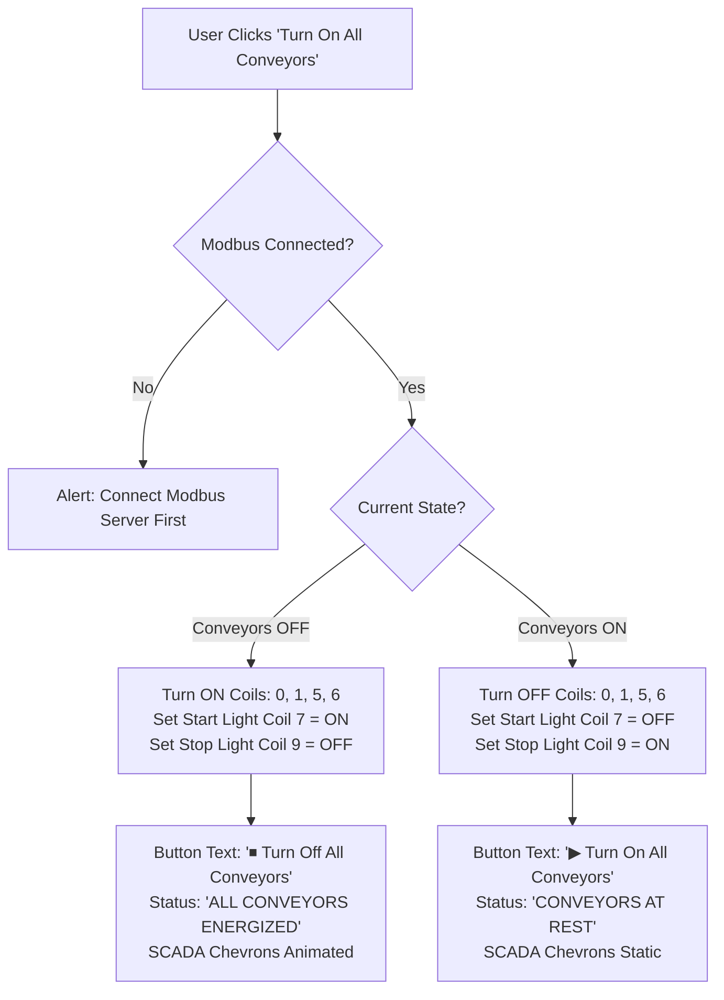
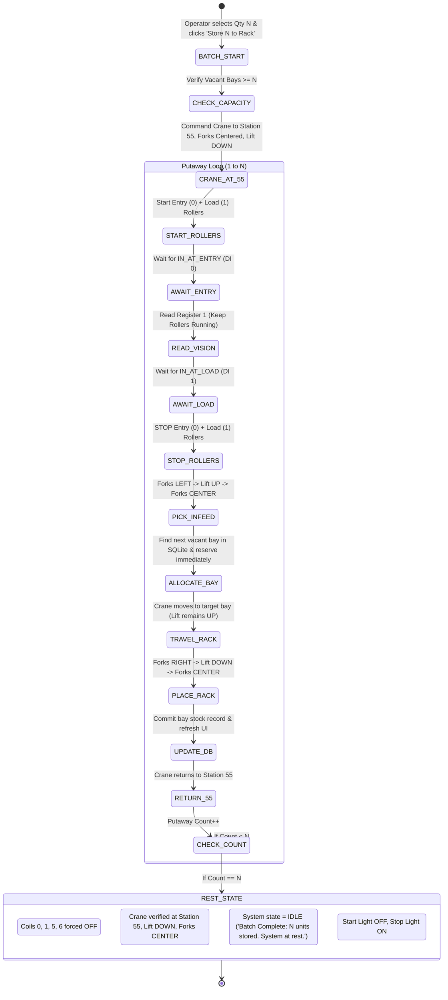
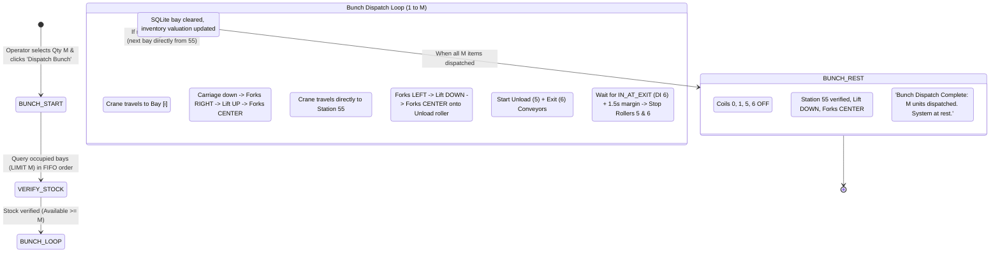

# Kanshi ASRS: Batch Putaway, Bunch Dispatch & Master Conveyor Control Plan

## 1. Executive Summary & User Requirements

The objective of this upgrade is to enhance the **Kanshi Automated Storage & Retrieval System (ASRS)** with deterministic batch controls and unified line management, moving beyond single-item retrieval and indefinite continuous scanning:

1. **Master Conveyor Control ("Turn On All Conveyors")**:
   - A single primary action button that immediately energizes all 4 material handling conveyors simultaneously:
     - `Coil 0` (`Entry Conveyor`)
     - `Coil 1` (`Load Conveyor`)
     - `Coil 5` (`Unload Conveyor`)
     - `Coil 6` (`Exit Conveyor`)
   - Includes real-time toggle capability (`Turn On All Conveyors` $\leftrightarrow$ `Turn Off All Conveyors`) with panel indicator synchronization (`Start Light` / `Stop Light`).

2. **Inbound Putaway Batch Control (Store $N$ Products $\rightarrow$ Auto-Rest)**:
   - Operator selects target quantity $N$ (via intuitive dropdown: `1, 2, 3, 4, 5, 10, 15, Max Vacant`).
   - The embedded Soft-PLC (`AsrsAutomationEngine`) orchestrates the infeed, detection, pickup, bay allocation, and rack placement for **exactly $N$ items**.
   - As soon as the $N$-th pallet is securely deposited into its rack bay:
     - Both infeed rollers are de-energized.
     - The Stacker Crane returns to its designated Home position (**Station 55**), lowers carriage, and centers forks.
     - The entire system halts into a quiet **REST / IDLE** state with zero phantom motion.

3. **Outbound Bunch Dispatch Control (Dispatch $M$ Products as a Bunch $\rightarrow$ Auto-Rest)**:
   - Operators previously had to click individual bays one by one or filter by single SKUs.
   - A new **"Dispatch as a Bunch"** capability allows selecting $M$ units (via dropdown / selector: `1, 2, 3, 5, 10, All Stored`).
   - The Soft-PLC retrieves $M$ units sequentially in **FIFO** order (oldest stored first) or selected product type.
   - Outfeed conveyors discharge each pallet past the exit photoeye (`IN_AT_EXIT`).
   - Upon completing all $M$ dispatches:
     - Outfeed rollers are de-energized.
     - The Stacker Crane confirms rest alignment at **Station 55** with carriage lowered and forks centered.
     - System transitions to **REST / IDLE** state.

---

## 2. System Architecture & Modbus I/O Mapping

### 2.1 Factory I/O Driver Address Mapping Reference

```
                             [ HIGH-BAY STORAGE RACK (54 BAYS) ]
                                      Bays 1 .. 54
                                            ▲
                                            │ Telescopic Forks (Coil 2 Left / Coil 3 Right)
                                            │ Micro-Lift (Coil 4)
                                            ▼
[ INFEED LINE ]                 [ 2-AXIS STACKER CRANE ]               [ OUTFEED LINE ]
Entry Conveyor (Coil 0) ──► Load Conveyor (Coil 1) ──► [Station 55] ──► Unload Conveyor (Coil 5) ──► Exit Conveyor (Coil 6)
  👁️ At Entry (DI 0)          👁️ At Load (DI 1)                          👁️ At Unload (DI 5)          👁️ At Exit (DI 6)
```

| Component | Modbus Address | Signal Logic | Role in Batch Operations |
|:---|:---:|:---:|:---|
| **Entry Conveyor** | `Coil 0` | Active High (`1`=ON) | Infeed line intake; runs during batch putaway until sensed. |
| **Load Conveyor** | `Coil 1` | Active High (`1`=ON) | Infeed crane bed transfer; stops when pallet triggers `At Load`. |
| **Forks Left** | `Coil 2` | Active High (`1`=Extend) | Extends left at Station 55 to pick infeed or deposit outfeed. |
| **Forks Right** | `Coil 3` | Active High (`1`=Extend) | Extends right to place pallet into or pick pallet from rack. |
| **Lift** | `Coil 4` | Active High (`1`=Up) | Micro-elevation platform (~100mm lift). |
| **Unload Conveyor** | `Coil 5` | Active High (`1`=ON) | Outfeed receiving roller from crane bed. |
| **Exit Conveyor** | `Coil 6` | Active High (`1`=ON) | Outfeed exit clearance conveyor to warehouse depot. |
| **Start / Stop Lights** | `Coil 7 / 9` | Active High (`1`=Lit) | Physical console pilot indicators. |
| **At Entry Sensor** | `DI 0` | Active LOW (`0`=Blocked) | Optical sensor triggers vision read of product type register 1. |
| **At Load Sensor** | `DI 1` | Active LOW (`0`=Blocked) | Optical sensor confirms pallet fully on crane infeed bed. |
| **Forks Left / Middle / Right** | `DI 2, 3, 4` | Active HIGH (`1`=At Pos) | Limit switches confirming telescopic fork extension and centering. |
| **At Unload / At Exit** | `DI 5, 6` | Active LOW (`0`=Blocked) | Optical sensors tracking outbound pallet clearance. |
| **Crane Target Setpoint** | `Holding Reg 0` | Numerical (`1`..`55`) | Coordinate setpoint (`1`..`54` rack bays, `55` Station 55). |

---

## 3. Operational Logic & State Machines

### 3.1 Feature 1: Master "Turn On All Conveyors" Logic



---

### 3.2 Feature 2: Inbound Batch Putaway ($N$ Items $\rightarrow$ Auto-Rest)

#### State Flow:


---

### 3.3 Feature 3: Outbound Bunch Dispatch ($M$ Items $\rightarrow$ Auto-Rest)

#### State Flow:


---

## 4. UI / UX Design & Component Additions

### 4.1 SCADA Studio Header Toolbar Redesign

In [`main-app-view.fxml`](file:///c:/Users/Lenovo/IdeaProjects/kanshi-warehouse-management-system/src/main/resources/com/example/kanshiwarehousemanagementsystem/main-app-view.fxml), the hardware action area will feature clean, distinct controls:

```
[ Host: 127.0.0.1 ] [ Port: 502 ] [ Connect Station ] (● CONNECTED)

[ ▶ Turn On All Conveyors ] 

[ 📥 Infeed Batch: ( [ 3 Pallets ▼ ] [ Store to Rack ] ) ]

[ 📤 Dispatch Bunch: ( [ 5 Pallets ▼ ] [ Dispatch Bunch ] ) ]

[ ⚡ 2s Motor Test ] [ 🛑 EMERGENCY STOP ]
```

### 4.2 Control Elements Specification:
1. **Conveyor Master Button**:
   - `fx:id="btnStartAll"`: Toggles all 4 line conveyors.
   - Text: `"▶ Turn On All Conveyors"` (off) / `"⏹ Turn Off All Conveyors"` (on).
   - Style: Sleek dark emerald pill (`#14532d`) toggling to charcoal (`#374151`).

2. **Putaway Batch Selector & Button**:
   - `fx:id="cmbPutawayBatchQty"`: ComboBox populated with `[1, 2, 3, 4, 5, 6, 8, 10, 15, Max Vacant]`.
   - `fx:id="btnStoreBatch"`: Button `"📥 Store to Rack"`.
   - Live badge: Displays dynamic progress e.g. `"Storing 2 / 5"`.

3. **Bunch Dispatch Selector & Button**:
   - `fx:id="cmbDispatchBatchQty"`: ComboBox dynamically populated with available unit increments up to total stored items: `[1, 2, 3, 4, 5, 10, All Stored]`.
   - `fx:id="btnDispatchBatch"`: Button `"📤 Dispatch Bunch"`.
   - Live badge: Displays dynamic progress e.g. `"Dispatching 3 / 5"`.

4. **Dedicated Dispatch Bunch Dialog** (optional modal for detailed control):
   - Supports selecting either `"All Types (FIFO)"` or specific product category/SKU, with preview of target bays.

---

## 5. Software Implementation Specifications

### 5.1 `InventoryDao.java` Additions
- `getOccupiedBays(int limit)`: Retrieves the oldest occupied bay numbers ordered by FIFO timestamp (`date_added ASC, id ASC`).
- `getTotalStoredCount()`: Fast count of stored bays (`status = 'STORED' AND location LIKE 'Bay-%'`).
- `getVacantCount(int totalBays)`: Calculates remaining empty bays (`totalBays - getTotalStoredCount()`).

### 5.2 `AsrsAutomationEngine.java` Enhancements
- `startBatchPutaway(int targetCount, BiConsumer<Integer, Integer> progressCallback, Runnable onComplete)`:
  - Validates rack availability.
  - Manages atomic putaway cycle loop for exactly $N$ iterations.
  - Automatically executes full rest shutdown at completion.
- `requestBunchDispatch(int requestedQty, BiConsumer<Integer, Integer> progressCallback, BiConsumer<Boolean, String> onComplete)`:
  - Retrieves $M$ bays via FIFO query.
  - Executes sequential retrieval and outfeed.
  - Automatically executes full rest shutdown at completion.
- `turnAllConveyors(boolean on)`:
  - Direct atomic write to coils 0, 1, 5, and 6.

### 5.3 `MainAppController.java` Integration
- Wire `@FXML private ComboBox<String> cmbPutawayBatchQty;` and `@FXML private Button btnStoreBatch;`.
- Wire `@FXML private ComboBox<String> cmbDispatchBatchQty;` and `@FXML private Button btnDispatchBatch;`.
- Add event handlers:
  - `handleToggleAllConveyors()`: Master conveyor toggle.
  - `handleStartBatchPutaway()`: Triggers $N$-item inbound cycle with progress indicators.
  - `handleStartBunchDispatch()`: Triggers $M$-item outbound bunch dispatch with progress indicators.
- Update UI tiles, KPI cards, and audit logger upon batch completion.

---

## 6. Verification & Test Plan

| ID | Test Scenario | Expected Outcome |
|:---|:---|:---|
| **TC-01** | Click "Turn On All Conveyors" | Coils 0, 1, 5, 6 energize immediately; button text updates to "Turn Off All Conveyors"; SCADA shows active flow. |
| **TC-02** | Click "Turn Off All Conveyors" | Coils 0, 1, 5, 6 de-energize immediately; button text resets to "Turn On All Conveyors". |
| **TC-03** | Batch Putaway $N=1$ | 1 pallet enters, identified, placed in vacant bay, crane returns to Station 55, all rollers shut down, system enters IDLE rest. |
| **TC-04** | Batch Putaway $N=3$ | 3 pallets sequentially stored into 3 distinct bays. After 3rd pallet, rollers stop, crane parks at Station 55, system enters IDLE rest. |
| **TC-05** | Bunch Dispatch $M=2$ (FIFO) | Crane fetches 2 oldest stored pallets sequentially to outfeed, rollers discharge them, crane parks at Station 55, system enters IDLE rest. |
| **TC-06** | Out of Stock / Overcapacity Check | Attempting to store more than vacant bays or dispatch more than stored items displays friendly validation alert. |
| **TC-07** | E-Stop Interruption | E-Stop halts any active batch immediately, shuts down all coils, and safely clears active counters. |
| **TC-08** | Unit Regression Tests | All 33 existing unit tests (`InventoryDaoTest`, `FloorLayoutServiceTest`, etc.) pass with zero regressions. |
