# Factory I/O Automated Warehouse (ASRS) Integration & PLC Automation Plan

## 1. Executive Overview

This document outlines the architectural blueprint, Modbus I/O mapping, PLC logic design, and software integration plan to make the **Factory I/O "Automated Warehouse"** (v2.5.10) the default operational environment for the **KANSHI Warehouse Management System (IT/OT Convergence)**.

The Automated Warehouse scene models an industrial **Automated Storage and Retrieval System (ASRS)** consisting of:
1. **High-Bay Pallet Rack Matrix**: 9 Columns $\times$ 6 Vertical Levels = **54 Storage Bays**.
2. **2-Axis Stacker Crane**: High-speed horizontal traverse ($X$-axis), vertical mast hoist ($Z$-axis), and bi-directional telescopic forks with micro-lift capability.
3. **Inbound Infeed Conveyor Line**: Entry conveyor and load positioning station with optical proximity sensors.
4. **Outbound Outfeed Conveyor Line**: Unload receiving conveyor and exit discharge conveyor.
5. **Industrial Control Console**: Physical pushbuttons (*Start, Stop, Reset, Emergency Stop, Auto/Manual Mode*) and indicator pilot lamps.

---

## 2. Factory I/O Modbus TCP Driver I/O Mapping

Based on the Factory I/O Driver configuration (`Modbus TCP/IP Server`, Default Port: `502`, Slave ID: `1`), the complete physical pin mapping is specified below:

### 2.1 Discrete Inputs (Sensors & Pushbuttons — Modbus Function Code 02)

| Modbus Address | Tag Name in Factory I/O | Industrial Type | Signal Behavior | Functional Description |
|:---:|:---|:---:|:---:|:---|
| **Input 0** | `At Entry` | Photoeye (Digital) | Active High (`1` when blocked) | Detects incoming pallet on Entry Conveyor. |
| **Input 1** | `At Load` | Photoeye (Digital) | Active High (`1` when blocked) | Pallet arrived at Stacker Crane pick-up station. |
| **Input 2** | `At Left` | Proximity Sensor | Active High (`1` when extended) | Telescopic forks fully extended into Left bay/conveyor. |
| **Input 3** | `At Middle` | Proximity Sensor | Active High (`1` when centered) | Telescopic forks safely centered on crane platform. |
| **Input 4** | `At Right` | Proximity Sensor | Active High (`1` when extended) | Telescopic forks fully extended into Right bay/conveyor. |
| **Input 5** | `At Unload` | Photoeye (Digital) | Active High (`1` when blocked) | Pallet deposited onto outbound Unload Conveyor. |
| **Input 6** | `At Exit` | Photoeye (Digital) | Active High (`1` when blocked) | Pallet reached exit discharge clearance zone. |
| **Input 7** | `Moving X` | Crane Feedback | `1` = Traveling, `0` = Stopped | Crane rail carriage is traveling horizontally ($X$-axis). |
| **Input 8** | `Moving Z` | Hoist Feedback | `1` = Hoisting, `0` = Stopped | Crane platform is traveling vertically ($Z$-axis). |
| **Input 9** | `Start` | Pushbutton (N.O.) | Momentary High (`1` on press) | Operator panel "Start Auto Cycle" pushbutton. |
| **Input 10** | `Reset` | Pushbutton (N.O.) | Momentary High (`1` on press) | Operator panel "Fault Reset / Home" pushbutton. |
| **Input 11** | `Stop` | Pushbutton (N.C.) | `1` Normal, `0` on press | Operator panel "Cycle Stop" pushbutton. |
| **Input 12** | `Emergency stop` | E-Stop (N.C.) | `1` Safe, `0` Tripped | Operator panel Emergency Stop mushroom button. |
| **Input 13** | `Auto` | Selector Switch | `1` = Auto, `0` = Manual | Control mode selector switch. |
| **Input 14** | `FACTORY I/O (Running)` | Status Bit | `1` = Sim Active, `0` = Paused | Heartbeat handshake indicating simulation engine is running. |

---

### 2.2 Coils / Digital Outputs (Actuators & Pilot Lamps — Modbus Function Code 05)

| Modbus Address | Tag Name in Factory I/O | Industrial Type | Normal State | Functional Description |
|:---:|:---|:---:|:---:|:---|
| **Coil 0** | `Entry Conveyor` | Motor Starter | `0` (Off) | Drives inbound pallet onto receiving conveyor. |
| **Coil 1** | `Load Conveyor` | Motor Starter | `0` (Off) | Drives pallet into position directly in front of ASRS crane. |
| **Coil 2** | `Forks Left` | Solenoid / Drive | `0` (Retracted) | Extends telescopic forks left towards rack shelves. |
| **Coil 3** | `Forks Right` | Solenoid / Drive | `0` (Retracted) | Extends telescopic forks right (if double-deep/right layout). |
| **Coil 4** | `Lift` | Hydraulic / Hoist | `0` (Lowered) | Micro-elevation: raises fork platform ~100mm to pick pallet off supports. |
| **Coil 5** | `Unload Conveyor` | Motor Starter | `0` (Off) | Drives pallet away from crane drop-off position. |
| **Coil 6** | `Exit Conveyor` | Motor Starter | `0` (Off) | Discharges pallet from warehouse exit. |
| **Coil 7** | `Start light` | 24V Indicator Lamp | `0` (Off) | Panel green lamp indicating auto cycle active. |
| **Coil 8** | `Reset light` | 24V Indicator Lamp | `0` (Off) | Panel amber lamp indicating system needs reset/homing. |
| **Coil 9** | `Stop light` | 24V Indicator Lamp | `0` (Off) | Panel red lamp indicating cycle stopped or idle. |

---

### 2.3 Holding Registers (Numerical Setpoints — Modbus Function Code 06 / 03)

| Modbus Address | Tag Name in Factory I/O | Data Format | Range | Functional Description |
|:---:|:---|:---:|:---:|:---|
| **Holding Reg 0** | `Target Position` | 16-bit Unsigned Word | `1` .. `55` | **Target coordinate setpoint for the ASRS crane.**<br>• `1` .. `54`: Storage Bays (9 cols $\times$ 6 rows).<br>• `55`: Loading (Infeed) Station pick-up bay.<br>• `0`: Home position. |

---

## 3. High-Bay Storage Rack Layout & Addressing Matrix

The physical rack consists of 9 horizontal columns and 6 vertical storage levels:

```
Level 6 [Bay 46] [Bay 47] [Bay 48] [Bay 49] [Bay 50] [Bay 51] [Bay 52] [Bay 53] [Bay 54]
Level 5 [Bay 37] [Bay 38] [Bay 39] [Bay 40] [Bay 41] [Bay 42] [Bay 43] [Bay 44] [Bay 45]
Level 4 [Bay 28] [Bay 29] [Bay 30] [Bay 31] [Bay 32] [Bay 33] [Bay 34] [Bay 35] [Bay 36]
Level 3 [Bay 19] [Bay 20] [Bay 21] [Bay 22] [Bay 23] [Bay 24] [Bay 25] [Bay 26] [Bay 27]
Level 2 [Bay 10] [Bay 11] [Bay 12] [Bay 13] [Bay 14] [Bay 15] [Bay 16] [Bay 17] [Bay 18]
Level 1 [Bay 01] [Bay 02] [Bay 03] [Bay 04] [Bay 05] [Bay 06] [Bay 07] [Bay 08] [Bay 09]
        Col 1    Col 2    Col 3    Col 4    Col 5    Col 6    Col 7    Col 8    Col 9

[Infeed Station: Bay 55] ──▶ [Crane Pick] ──▶ [Transfer to Bay 1..54] ──▶ [Outfeed Unload]
```

---

## 4. PLC Programming Architecture & Recommendations

### Recommended Approach: Direct Embedded Java Soft-PLC in Kanshi WMS (with IEC 61131-3 Ladder Logic specification)

To give you the easiest, most reliable, and complete solution without forcing you to buy or install external software (like Codesys or TIA Portal), Kanshi WMS will feature an **Embedded Java Automation Engine (Soft-PLC)** running a deterministic 50ms cyclic state machine. 

Furthermore, for academic or real-world industrial compliance, we provide the **IEC 61131-3 Structured Text (ST)** logic specification below, which can be pasted directly into **OpenPLC**, **Codesys**, or **Siemens S7-1200**.

### 4.1 State Machine Design: Putaway Sequence (Inbound Storage)

```mermaid
stateDiagram-v2
    [*] --> IDLE
    IDLE --> INFEED_CONVEY: At Entry (Input 0) triggered
    INFEED_CONVEY --> AT_LOAD_WAIT: Pallet moving towards crane
    AT_LOAD_WAIT --> CRANE_MOVE_INFEED: At Load (Input 1) triggered; Stop Load Conveyor
    CRANE_MOVE_INFEED --> PICK_EXTEND_FORKS: Target Position = 55; Wait (Moving X == 0 && Moving Z == 0)
    PICK_EXTEND_FORKS --> PICK_LIFT_UP: Forks Left (Coil 2) ON; Wait At Left (Input 2)
    PICK_LIFT_UP --> PICK_RETRACT_FORKS: Lift (Coil 4) ON; Pallet lifted
    PICK_RETRACT_FORKS --> TRAVEL_TO_BAY: Forks Left OFF; Wait At Middle (Input 3)
    TRAVEL_TO_BAY --> PLACE_EXTEND_FORKS: Target Position = TargetBay; Wait (Moving X == 0 && Moving Z == 0)
    PLACE_EXTEND_FORKS --> PLACE_LIFT_DOWN: Forks Left (Coil 2) ON; Wait At Left (Input 2)
    PLACE_LIFT_DOWN --> PLACE_RETRACT_FORKS: Lift (Coil 4) OFF; Pallet resting on rack supports
    PLACE_RETRACT_FORKS --> UPDATE_WMS_DB: Forks Left OFF; Wait At Middle (Input 3)
    UPDATE_WMS_DB --> IDLE: SQLite Inventory updated (Bay marked OCCUPIED)
```



### 4.2 State Machine Design: Retrieval Sequence (Outbound Invoicing / Fulfillment)

```mermaid
stateDiagram-v2
    [*] --> WAIT_ORDER
    WAIT_ORDER --> CRANE_TRAVEL_BAY: WMS dispatches Retrieval for TargetBay
    CRANE_TRAVEL_BAY --> RETRIEVE_EXTEND_FORKS: Target Position = TargetBay; Wait (Moving X == 0 && Moving Z == 0)
    RETRIEVE_EXTEND_FORKS --> RETRIEVE_LIFT_UP: Forks Left ON; Wait At Left (Input 2)
    RETRIEVE_LIFT_UP --> RETRIEVE_RETRACT_FORKS: Lift (Coil 4) ON; Pallet lifted from rack
    RETRIEVE_RETRACT_FORKS --> CRANE_TRAVEL_UNLOAD: Forks Left OFF; Wait At Middle (Input 3)
    CRANE_TRAVEL_UNLOAD --> DEPOSIT_EXTEND_FORKS: Target Position = 55 (Unload Station); Wait (Moving X == 0 && Moving Z == 0)
    DEPOSIT_EXTEND_FORKS --> DEPOSIT_LIFT_DOWN: Forks Left ON; Wait At Left
    DEPOSIT_LIFT_DOWN --> DEPOSIT_RETRACT_FORKS: Lift OFF; Pallet resting on Unload Conveyor
    DEPOSIT_RETRACT_FORKS --> DISCHARGE_PALLET: Forks Left OFF; Wait At Middle
    DISCHARGE_PALLET --> OUTFEED_CLEAR: Unload Conveyor (Coil 5) & Exit Conveyor (Coil 6) ON
    OUTFEED_CLEAR --> WAIT_ORDER: At Exit (Input 6) senses pallet discharge; Deduct SQLite Stock
```



---

### 4.3 Structured Text (IEC 61131-3) Equivalent for External PLCs (OpenPLC / Codesys)

```pascal
PROGRAM AutomatedWarehouse_Controller
VAR
    (* Inputs from Factory I/O *)
    AtEntry        AT %IX0.0 : BOOL;
    AtLoad         AT %IX0.1 : BOOL;
    AtLeft         AT %IX0.2 : BOOL;
    AtMiddle       AT %IX0.3 : BOOL;
    AtRight        AT %IX0.4 : BOOL;
    AtUnload       AT %IX0.5 : BOOL;
    AtExit         AT %IX0.6 : BOOL;
    MovingX        AT %IX0.7 : BOOL;
    MovingZ        AT %IX1.0 : BOOL;
    BtnStart       AT %IX1.1 : BOOL;
    BtnReset       AT %IX1.2 : BOOL;
    BtnStop        AT %IX1.3 : BOOL;
    EStop          AT %IX1.4 : BOOL;
    AutoMode       AT %IX1.5 : BOOL;

    (* Outputs to Factory I/O *)
    EntryConveyor  AT %QX0.0 : BOOL;
    LoadConveyor   AT %QX0.1 : BOOL;
    ForksLeft      AT %QX0.2 : BOOL;
    ForksRight     AT %QX0.3 : BOOL;
    Lift           AT %QX0.4 : BOOL;
    UnloadConveyor AT %QX0.5 : BOOL;
    ExitConveyor   AT %QX0.6 : BOOL;
    LightStart     AT %QX0.7 : BOOL;
    LightReset     AT %QX1.0 : BOOL;
    LightStop      AT %QX1.1 : BOOL;
    TargetPosition AT %QW0   : INT;  (* Holding Register 0 *)

    (* Internal State Machine Variables *)
    State          : INT := 0; (* 0: IDLE, 10: INFEED, 20: PICK, 30: TRANSFER, 40: PLACE *)
    AssignedBay    : INT := 1;
END_VAR

(* Safety Interlock: Immediate E-Stop Halts Everything *)
IF NOT EStop THEN
    EntryConveyor  := FALSE;
    LoadConveyor   := FALSE;
    ForksLeft      := FALSE;
    ForksRight     := FALSE;
    Lift           := FALSE;
    UnloadConveyor := FALSE;
    ExitConveyor   := FALSE;
    LightStop      := TRUE;
    LightStart     := FALSE;
    State          := 999; (* Emergency State *)
    RETURN;
END_IF;

CASE State OF
    0: (* IDLE *)
        LightStart := FALSE;
        LightStop  := TRUE;
        IF BtnStart AND AutoMode THEN
            State := 10;
        END_IF;

    10: (* INFEED CONVEYOR RUN *)
        LightStart := TRUE;
        LightStop  := FALSE;
        EntryConveyor := TRUE;
        LoadConveyor  := TRUE;
        IF AtLoad THEN
            LoadConveyor  := FALSE;
            EntryConveyor := FALSE;
            TargetPosition := 55; (* Position 55 is the infeed load station *)
            State := 20;
        END_IF;

    20: (* CRANE PICK PALLET FROM INFEED *)
        IF NOT MovingX AND NOT MovingZ THEN
            ForksLeft := TRUE;
            IF AtLeft THEN
                Lift := TRUE; (* Lift pallet off roller bed *)
                ForksLeft := FALSE; (* Retract back *)
                State := 25;
            END_IF;
        END_IF;

    25: (* WAIT FOR FORKS CENTERED *)
        IF AtMiddle THEN
            TargetPosition := AssignedBay; (* Travel to destination bay *)
            State := 30;
        END_IF;

    30: (* TRAVEL & PLACE ON RACK *)
        IF NOT MovingX AND NOT MovingZ THEN
            ForksLeft := TRUE; (* Extend into rack shelf *)
            IF AtLeft THEN
                Lift := FALSE; (* Lower pallet onto rack supports *)
                ForksLeft := FALSE; (* Retract forks to middle *)
                State := 35;
            END_IF;
        END_IF;

    35: (* CONFIRM FORKS CLEAR *)
        IF AtMiddle THEN
            (* Advance next bay allocation for subsequent pallet *)
            AssignedBay := AssignedBay + 1;
            IF AssignedBay > 54 THEN AssignedBay := 1; END_IF;
            State := 0; (* Cycle complete *)
        END_IF;
END_CASE;
```

---

## 5. New Dedicated Module: $N \times M$ High-Bay Storage Matrix (Warehouse Digital Twin)

To provide complete spatial visibility of the automated warehouse, Kanshi WMS will feature a dedicated workspace module: **Level 2E: High-Bay $N \times M$ Storage Matrix (Spatial Storage Map & Digital Twin)**.

```
┌─────────────────────────────────────────────────────────────────────────────────────────────┐
│ 🗄️ HIGH-BAY RACK SPATIAL STORAGE MATRIX & DIGITAL TWIN                                      │
├─────────────────────────────────────────────────────────────────────────────────────────────┤
│ Total Capacity: 54 Bays  │  Occupied: 22 Bays (40.7%)  │  Vacant: 32 Bays  │  Valuation: $18,450.00 │
├─────────────────────────────────────────────────────────────────────────────────────────────┤
│ Filter SKU: [Search SKU / Item... 🔍]    Category: [All Categories ▼]   [⚡ Dispatch Next Pallet] │
├─────────────────────────────────────────────────────────────────────────────────────────────┤
│ L6 [Bay 46: Empty]  [Bay 47: BOX-SML] [Bay 48: Empty]   ... [Bay 54: SEN-OPT]                │
│ L5 [Bay 37: PAL-EUR] [Bay 38: Empty]   [Bay 39: BOX-MED] ... [Bay 45: Empty]                 │
│ L4 [Bay 28: Empty]  [Bay 29: Empty]   [Bay 30: PAL-EUR] ... [Bay 36: BOX-SML]               │
│ L3 [Bay 19: BOX-MED] [Bay 20: SEN-OPT] [Bay 21: Empty]   ... [Bay 27: Empty]                 │
│ L2 [Bay 10: Empty]  [Bay 11: BOX-SML] [Bay 12: Empty]   ... [Bay 18: PAL-EUR]               │
│ L1 [Bay 01: PAL-EUR] [Bay 02: Empty]   [Bay 03: SEN-OPT] ... [Bay 09: Empty] ◄ Crane X=1,Z=1│
│         Col 1           Col 2            Col 3                  Col 9                       │
└─────────────────────────────────────────────────────────────────────────────────────────────┘
```

### 5.1 Key Features of the $N \times M$ Matrix Module:
1. **Dynamic Configurable $N \times M$ Grid**:
   - Default configured for Factory I/O Automated Warehouse: **9 Columns $\times$ 6 Vertical Levels (54 storage cells)**.
   - Extensible to any arbitrary $N \times M$ warehouse dimension.
2. **Real-Time Visual State Machine for Each Bay**:
   - 🟩 **EMPTY**: Available bay slot (soft emerald border `#bbf7d0`, light mint canvas `#f0fdf4`).
   - 🟦 **OCCUPIED**: Showing SKU code badge, product description, quantity count, and category color tag (white card `#ffffff`, blue/green indicator `#1d4ed8`).
   - 🟧 **ACTIVE TARGET**: Pulsing amber border (`#f59e0b`) indicating the Stacker Crane is currently moving to or loading/unloading this specific bay.
   - 🟥 **RESERVED**: Bay earmarked for an outbound commercial invoice pending retrieval.
3. **Interactive Click-to-Operate Cell Modal**:
   - **Click on Occupied Bay**:
     - Displays full SKU details, quantity, unit price, total value, and date stored.
     - Button: **`🚀 Retrieve Pallet (Dispatch Crane)`** — Commands the Stacker Crane to travel to this bay, pick the pallet, and transport it to the outfeed conveyor!
     - Button: **`📋 View Transaction History`**.
   - **Click on Empty Bay**:
     - Button: **`📦 Allocate Pallet for Storage`** — Manually pre-allocate inbound inventory to this bay.
     - Button: **`🎯 Move Crane to Bay`** — Direct manual positioning test for maintenance diagnostics.
4. **Live Storage Capacity Analytics Bar**:
   - Total Bays, Occupied Count, Vacant Count, Space Utilization percentage gauge, and Total Rack Inventory Valuation.
5. **Interactive Search & Filter**:
   - Instant search by SKU, Product Name, or Category: highlights matching bays in vibrant emerald green while dimming non-matching bays.
6. **Navigation Integration**:
   - Left Navigation Rail button: **`🗄️ Rack Storage Matrix`** (`btnNavMatrix`).
   - Top Executive Dashboard gateway card for immediate access.

---

## 6. Kanshi WMS Implementation Steps

### Phase 1: Modbus Protocol Enhancement
- **Update `ModbusTcpClient.java`**:
  - Add Function Code `0x06` (`writeSingleRegister(int address, int value)`) to send `Target Position` word (`1`..`55`) to Holding Register 0.
  - Add Function Code `0x03` (`readHoldingRegisters(int startAddress, int count)`) to monitor current setpoint.
- **Update `ModbusTag.java`**:
  - Add `HOLDING_REGISTER` to `TagType` enum with integer setpoint support.

### Phase 2: Configuration & Default Tag Profiler
- **Replace `warehouse_tags.json`**:
  - Populate with all 15 Discrete Inputs (0..14) and 10 Coils (0..9) matching Factory I/O Automated Warehouse driver pinout.
  - Add `Target Position` Holding Register 0.
- Update `TagManager.java` default fallback scene to Automated Warehouse.

### Phase 3: SQLite High-Bay Rack Inventory Modeling
- **Update `inventory` table schema & seed data**:
  - Store bay allocation `location` formatted as `Bay-01` to `Bay-54`.
  - Add query methods in `InventoryDao.java`:
    - `getBayOccupancyMap()`: Returns a mapping of all 54 bays with product details or null if empty.
    - `findNextAvailableBay()`: Automatically returns the lowest numbered empty bay (1..54).
    - `storePalletAtBay(String sku, int bayNumber, int qty)`: Stores pallet and updates stock.
    - `retrievePalletFromBay(int bayNumber)`: Clears bay and decrements stock.

### Phase 4: Implement Level 2E $N \times M$ Rack Storage Matrix Workspace
- Create `paneStorageMatrix` in `main-app-view.fxml` with:
  - Header statistics cards (Capacity, Occupied, Vacant, Utilization, Valuation).
  - Search and filter bar.
  - 9 $\times$ 6 visual Grid matrix dynamically rendered and bound to SQLite inventory.
  - Interactive click handlers with Putaway & Retrieval action modals.
- Add Left Navigation rail button `🗄️ Storage Matrix` (`btnNavMatrix`).

### Phase 5: SCADA Studio 2D High-Bay Graphic Studio
- **Update `FloorLayoutService.java` & SCADA Canvas**:
  - Render an authentic 9 $\times$ 6 High-Bay Rack Matrix in the SCADA Station view.
  - Render Animated Stacker Crane moving along rails to target $X, Z$ positions.
  - Render Infeed & Outfeed conveyor belts with live sensor indicators.

### Phase 6: Kanshi Built-in Soft-PLC Automation Engine
- Implement `AsrsAutomationEngine.java` as a thread-safe, interruptible background service:
  - Supports **Full Automatic Mode**: Detects pallet at entry $\rightarrow$ finds next empty bay $\rightarrow$ crane picks up $\rightarrow$ crane stores pallet $\rightarrow$ updates SQLite inventory and increments dashboard KPI valuation.
  - Supports **Manual Retrieval Mode**: Click any occupied bay on the SCADA rack $\rightarrow$ Crane retrieves pallet $\rightarrow$ deposits onto Outfeed conveyor $\rightarrow$ clears inventory record.
  - Emergency Stop interlock tied to the physical button (Input 12) and the UI E-Stop button.

---

## 7. Verification and Acceptance Criteria
1. **Zero External CSS**: All UI enhancements remain 100% inline-styled.
2. **Factory I/O Connection**: Single-click connection to `127.0.0.1:502` or `20.20.20.57:502`.
3. **Modbus Handshake**: Live reading of all 15 sensors and writing of all 10 coils + 1 holding register verified.
4. **Interactive $N \times M$ Matrix**: Displays all 54 bays accurately reflecting SQLite inventory state.
5. **Full Automated Storage Cycle**: Dropping a pallet onto Factory I/O entry conveyor automatically stores it in a rack bay and records stock in SQLite.
6. **Full Automated Retrieval Cycle**: Requesting a retrieval in Kanshi WMS commands crane to fetch the pallet and deliver to outfeed conveyor.
7. **All Unit Tests Passing**.
